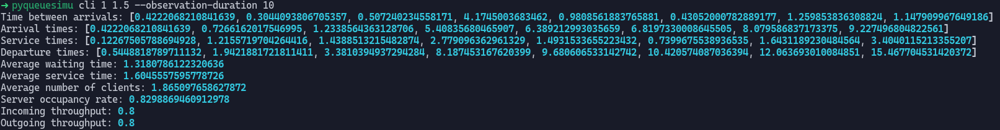
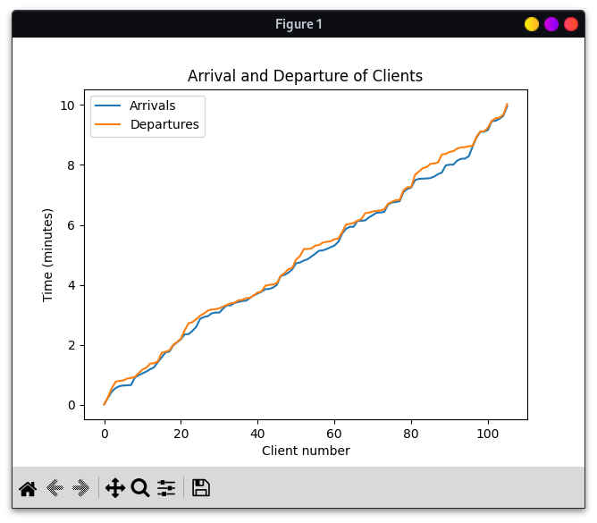
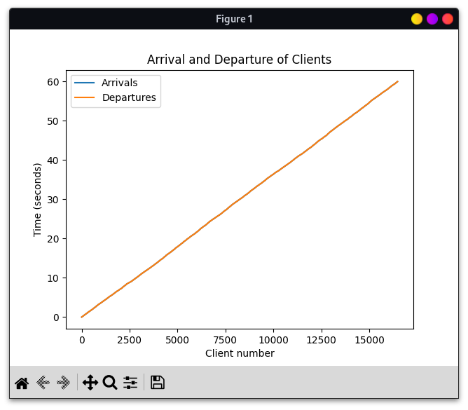
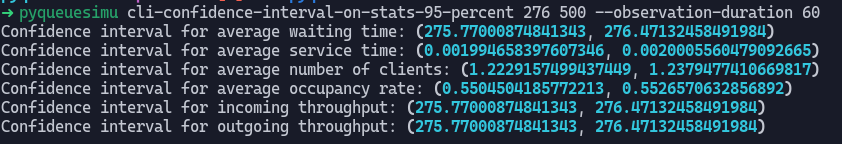

# pyqueuesimu

Simulation of queues.

Project made by Nathan ROUSSEAU and Swan FRERE as part of TELECOM Nancy's course "Performance evaluation". 

The subject is available [here](docs/subject.pdf).

## Table of Contents

<!-- TOC -->
* [pyqueuesimu](#pyqueuesimu)
  * [Table of Contents](#table-of-contents)
  * [Usage](#usage)
    * [Unix-based systems](#unix-based-systems)
    * [Windows](#windows)
<!-- TOC -->

## Usage

To use pyqueuesimu, run the commands specified according your operating system: [Unix-based](#unix-based-systems) or [Windows](#windows).

### Unix-based systems

```shell
# Move to the project's root
cd project_location
# Create a virtual environment to not pollute your system
python3 -m venv .venv
# Use your newly-created virtual environment
source .venv/bin/activate
# Install the project
pip install .
# Run pyqueuesimu with the parameters you want
pyqueuesimu cli 8 12 --observation-duration 10
pyqueuesimu gui 100 2 --observation-duration 60
# The list of parameters is available with the following command
pyqueuesimu --help
```

### Windows

```shell
# Move to the project's root
cd project_location
# Create a virtual environment to not pollute your system
python -m venv .venv
# Use your newly-created virtual environment
.venv/Scripts/activate
# Install the project
pip install .
# Run pyqueuesimu with the parameters you want
pyqueuesimu cli 8 12 --observation-duration 10
pyqueuesimu gui 100 2 --observation-duration 60
# The list of parameters is available with the following command
pyqueuesimu --help
```

## Examples

### cli

The `cli` command allows to output all the result to the command line interface.
It's mostly interesting with small numbers to don't get too much lines. 

```shell
pyqueuesimu cli 1 1.5 --observation-duration 10
```



### gui

The `gui` command works the same that `cli` but uses matplotlib to output the arrivals and departures.

```shell
pyqueuesimu gui 100 2 --observation-duration 60
```



### gui-example

The `gui-example` runs the queue simulation with GUI and coherent values based on the given k (default is 2).
The arrival rate is `(324 - 24*k)` requests/second and a service takes `(0.5 * k + 1)` ms/request.

```shell
pyqueuesimu gui-example --k=2
```




### cli-confidence-interval-on-stats-95-percent

Compute stats on the queue simulation with confidence interval of 95%.
To use the example with `k=2`, we can use the following command:

```shell
pyqueuesimu cli-confidence-interval-on-stats-95-percent 276 500 --observation-duration 60
```



