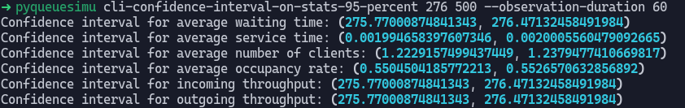

# pyqueuesimu 📊

pyqueuesimu is a Python tool for simulating queues.
It allows users to simulate queues with different parameters and observe the results.

pyqueuesimu was developed as part of TELECOM Nancy's course "Performance evaluation".
The subject is available [here](docs/subject.pdf).

## Table of Contents 📃

- [pyqueuesimu 📊](#pyqueuesimu-)
   * [Table of Contents 📃](#table-of-contents-)
   * [Installation 💻](#installation-)
   * [Usage 🚀](#usage-)
   * [Examples 📈](#examples-)
      + [cli](#cli)
      + [gui](#gui)
      + [gui-example](#gui-example)
      + [cli-confidence-interval-on-stats-95-percent](#cli-confidence-interval-on-stats-95-percent)
      + [With a limited buffer size](#with-a-limited-buffer-size)
   * [License 📜](#license-)

## Installation 💻

To install pyqueuesimu, follow these steps:

1. Clone the repository to your local machine.
2. Navigate to the project directory.
3. Create a virtual environment to avoid polluting your system: `python3 -m venv .venv` (`python -m venv .venv` in Windows)
4. Activate the virtual environment: `source .venv/bin/activate` (`.venv/Scripts/activate` in Windows)
5. Install the project: `pip install .`

## Usage 🚀

To use pyqueuesimu, run the `pyqueuesimu` command followed by the desired parameters. Here are some examples:

```shell
# Run a simulation with 8 clients and a service time of 1.5 seconds per client, observing for 10 seconds.
pyqueuesimu cli 8 1.5 --observation-duration 10

# Run a simulation with 100 clients and a service time of 2 seconds per client, observing for 60 seconds with a GUI.
pyqueuesimu gui 100 2 --observation-duration 60

# Run a simulation with GUI and coherent values based on the given k (default is 2).
pyqueuesimu gui-example --k=2
```

The full list of parameters is available with the following command: `pyqueuesimu --help`

## Examples 📈

Here are some examples of pyqueuesimu in action:

### cli

The `cli` command allows outputting all the results to the command-line interface. 
It's mostly useful with small numbers to avoid too many lines.

```shell
pyqueuesimu cli 1 1.5 --observation-duration 10
```


### gui

The `gui` command works the same as `cli` but uses [matplotlib](https://matplotlib.org/) to show the arrivals and departures.

```shell
pyqueuesimu gui 100 2 --observation-duration 60
```


### gui-example

The `gui-example` runs the queue simulation with GUI and coherent values based on the given `k` (default is 2).
The arrival rate is `(324 - 24*k)` requests/second and a service takes `(0.5 * k + 1)` ms/request.

```shell
pyqueuesimu gui-example --k=2
```


### cli-confidence-interval-on-stats-95-percent

Compute stats on the queue simulation with a confidence interval of 95%.
To use the example with `k=2`, we can use the following command:

```shell
pyqueuesimu cli-confidence-interval-on-stats-95-percent 276 500 --observation-duration 60
```



### With a limited buffer size

You can limit the buffer size using the `--buffer-size` parameter.

```shell
pyqueuesimu gui 10 15 --observation-duration 10 --buffer-size 0
```

Every red line indicates that the client was lost due to buffer limitation.


The loss rate will be shown for statistical purposes.


## License 📜

pyqueuesimu is released under the MIT License. See [LICENSE](LICENSE) for details.
